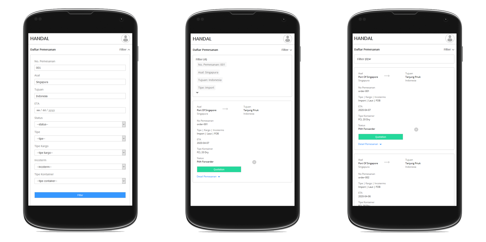
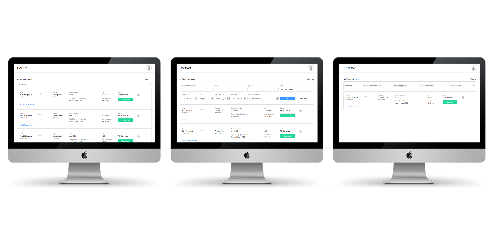

# HANDAL

HANDAL is application for handling shipping system

## demo

```
https://handal.netlify.app/
```

## Table of Contents

- [Getting Started](#getting-started)
  - [Prerequisites](#prerequisites)
  - [Installation](#installation)
- [Screenshots](#screenshots)
- [Built With](#built-with)
- [Author](#author)

## Getting Started

Before starting to install the project, there're some things that need to be done first.

### Prerequisites

Make sure all of these are properly installed in your system.

| Application | Download                                                                            |
| ----------- | ----------------------------------------------------------------------------------- |
| Git         | [Windows](https://gitforwindows.org/) / [Linux](https://git-scm.com/download/linux) |
| Node.js     | [Link](https://nodejs.org/en/download/)                                             |
| React.js    | [Link](https://reactjs.org/)                                                        |

### Installation

First, clone this repository into your system.

```
git clone https://github.com/ahmadkhairul/handal.git
```

Then, install all the packages that described `package.json` in directories.

```
npm install
```

Then, run the server in directories.

```
npm start
```

## Screenshots

### @media below width 600



### @media pc



## Built With

- [React JS](https://reactjs.org/) - Front-end

## Author

**Ahmad Khairul Anwar** - [Ahmad Khairul](https://github.com/ahmadkhairul)
